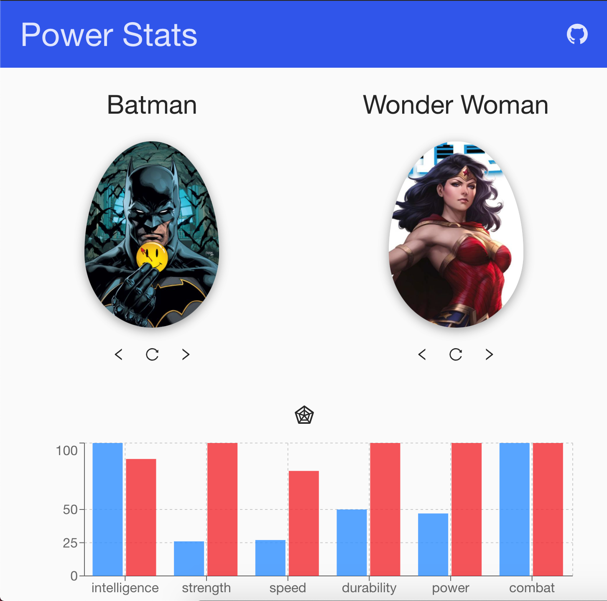
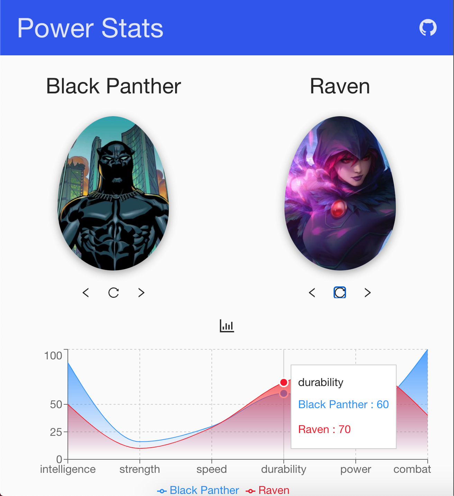

# Data visualization with super heroes

### Compare the strengths and weaknesses of your favorite heroes!

### `yarn add` to install dependencies

### `yarn run server`

### `yarn start`

### create your own `dotenv` with the following variables

> API_URL (https://superheroapi.com/api)

> API_KEY (you can get this token by creating a free account)
